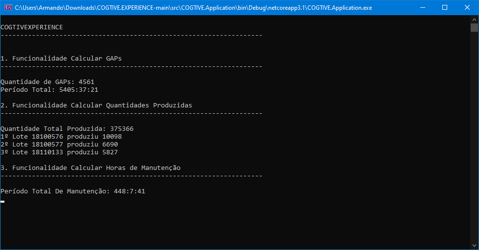
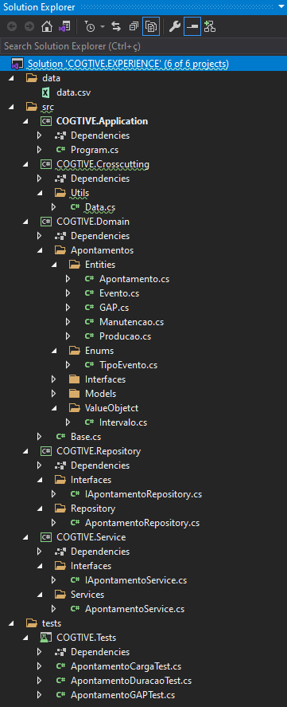

# 💻 COGTIVE.EXPERIENCE
<p align="center">
    <a href="https://www.linkedin.com/in/dev-full-stack/">
        
    </a>
</p>

---

### ⚔ Requisitos

#### 1. Funcionalidade Calcular GAPs

O programa deverá calcular todos os Gaps entre o primeiro e último apontamento. Deverá apresentar: quantidade de gaps encontrados e período total de duração de gaps (soma da duração de todos os gaps encontrados no formato horas:minutos:segundos)

#### 2. Funcionalidade Calcular Quantidades Produzidas

O programa deverá calcular a quantidade total produzida. (soma da quantidade de todos apontamentos com eventos igual a 1 ou 2). Deverá calcular também os 3 lotes com maior produção.

#### 3. Funcionalidade Calcular Horas de Manutenção

O programa deverá calcular período total de duração das manutenções (soma da duração de todos os eventos de manutenção no formato horas:minutos:segundos)

---

### 📷 Screenshots




---

## 🛠️ Tecnologias e Arquetetura

- C#;
- .NET ;
- DDD;
- Clean Architecture;

## ⏬ Como baixar o projeto
- <b style="color:red"> OBS: </b> É necessário ter o git instalado em sua máquina
- Executar o Seguinte comando no seu **Terminal** ou no **CMD**:

```bash
        git clone https://github.com/armandofc1/COGTIVE.EXPERIENCE.git
```


## ⌨️ Autor

<br>
<sub><b>Armando Costa</b></sub>

##### Contatos
[](https://www.linkedin.com/in/dev-full-stack/)

